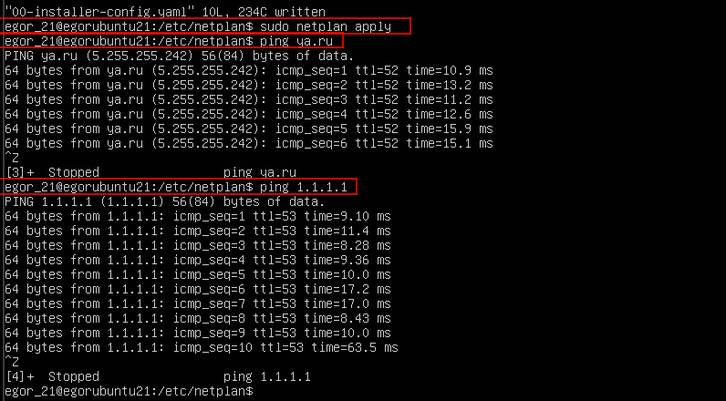
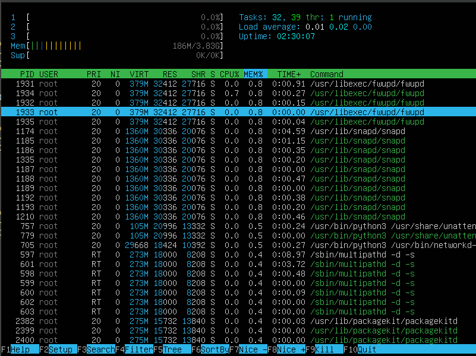
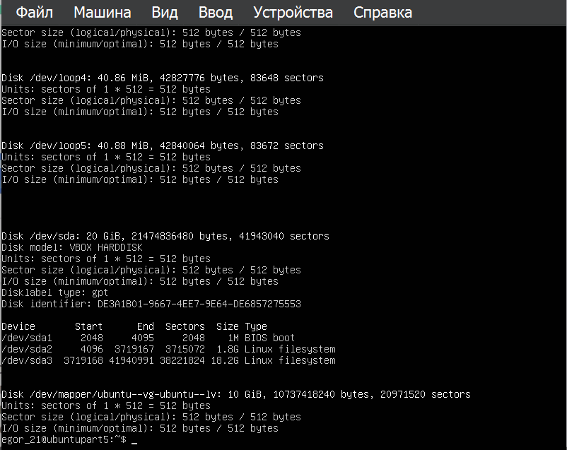
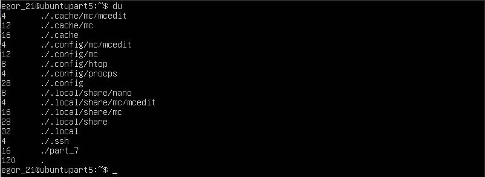
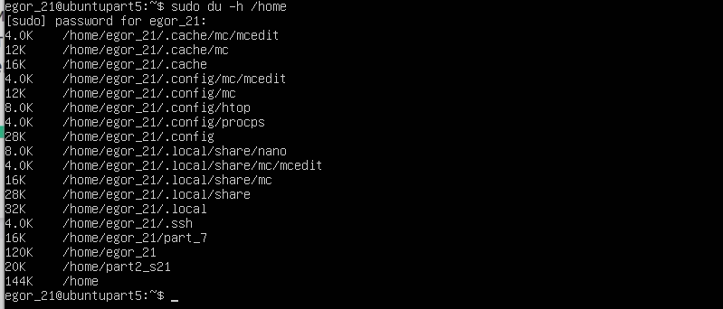
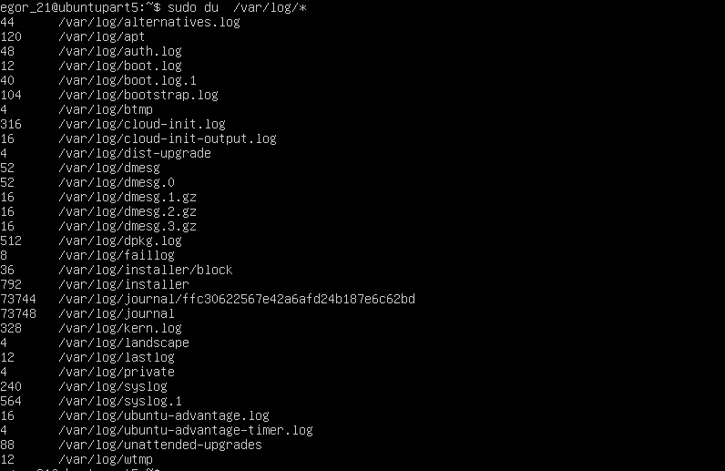

# Операционные системы UNIX/Linux (Базовый).

Отчет о выполнении задания D01_Linux

## Part 1. Установка ОС

\
Скриншот 1 - версия Ubuntu
#

## Part 2. Создание пользователя

\
Скриншот 2 - создание пользователя
#

\
Скриншот 3 - отображение пользователя при команде cat /etc/passwd
#

## Part 3. Настройка сети ОС
\
Зададние имени машины при помощи комнады sudo hostname
#

\
Скриншот 5 - Установка необхожимой временной зоны - команда sudo timedatectl set-timezone
#

\
Скриншот 6 - вывод названия сетевых  интерфейсов - ip link show

- lo (loopback device) – виртуальный интерфейс, присутствующий по умолчанию в любом Linux. Он используется для отладки сетевых программ и запуска серверных приложений на локальной машине.
С этим интерфейсом всегда связан адрес 127.0.0.1

#

\
Скриншот 7 - вывод ip адресса устройства - ip address
- DHCP (англ. Dynamic Host Configuration Protocol — протокол динамической настройки узла) — сетевой протокол, позволяющий сетевым устройствам автоматически получать IP-адрес и другие параметры, необходимые для работы в сети TCP/IP. Данный протокол работает по модели «клиент-сервер»
#

\
Скриншот 8 - вывод внутреннего ip адресса шлюза - hostname -i

\
Скриншот 9 - вывод внешнего ip адресса шлюза - curl ident.me
#

\
Скриншот 10 - проверка неактивности облачной инициализации

\
"Скриншот 11 - настройка статических ip адрессов через etc/netplan/00-installer-comfig.yaml"

#

\
Скриншот 12 - проверка неактивности облачной инициализации
- sudo netplan apply для применения новых настроек(для прошлого действия)
#

## Part 4. Обновление ОС

\
Скриншот 13 - вывод при команде sudo apt-update (обновления отсутствуют)
#

## Part 5. Использование команды sudo

`Sudo — это утилита, предоставляющая привилегии root для выполнения административных операций в соответствии со своими настройками. Она позволяет легко контролировать доступ к важным приложениям в системе. По умолчанию, при установке Ubuntu первому пользователю (тому, который создаётся во время установки) предоставляются полные права на использование sudo.`

\
Скриншот 14 - переключение пользователя на part2_s21
#

\
Скриншот 3 - изменение hostname пользователем part2_s21
#

## Part 6. Установка и настройка службы времени

\
Скриншот 16 - корректное время
#

## Part 7. Установка и использование текстовых редакторов

\
Скриншот 17 - создание файлов test_X.txt
#

## VIM
- Для открытия файла в vim используем команду  `  vim test_vim.txt`

.png "Скриншот 18 - содержимое файла test_vim.txt перед закрытием")\

Скриншот 18 - содержимое файла test_vim.txt перед закрытием

 - Для выхода из режима редактирования необходимо нажать `Esc`
 - Для сохранения изменений нужно прожать комбинацию `:qw!` (w-сохранить, q-выйти, !-выполнение команды)
#

.png "Скриншот 19 - перезапись файла без сохранения")\
Скриншот 19 - перезапись файла без сохранения

 - Для выхода без сохранения нужно прожать комбинацию `:q!`(в командном режиме)

 .png "Скриншот 20 - содержание файла после выхода без сохранения")\

 Скриншот 30 - содержание файла после выхода без сохранения
#

.png "Скриншот 21 - поиск в файле")\
Скриншот 21 - поиск в файле
- поиск проводится при помощи `/шаблон` (в командном режиме)
#

.png "Скриншот 22 - замена в файле")\
Скриншот 22 - замена в файле
- поиск проводится при помощи `s:/шаблон_поиска/шаблон_замены` (в командном режиме)

.png "Скриншот 23- результат замены")\
Скриншот 23 - результат замены
#

## Nano
- Для открытия файла в nano используем команду  `  nano test_nano.txt`

.png "Скриншот 24 - содержимое файла test_nano.txt перед закрытием")\

Скриншот 24 - содержимое файла test_nano.txt перед закрытием

 - Для сохранения изменений нужно прожать комбинацию `Ctrl + O`
#

.png "Скриншот 25 - перезапись файла без сохранения")\
Скриншот 25 - перезапись файла без сохранения

 - Для выхода без сохранения нужно прожать комбинацию `Ctrl + X`(и после согласиться на выход без сохранения)

 .png "Скриншот 26 - содержание файла после выхода без сохранения")\

 Скриншот 26 - содержание файла после выхода без сохранения
#

.png "Скриншот 27 - поиск в файле")\
Скриншот 27 - поиск в файле
- поиск проводится при помощи `Ctrl + W`
#

.png "Скриншот 28 - замена в файле")\
Скриншот 28 - замена в файле
- поиск проводится при помощи `Ctrl + \` Введите часть текста, которую хотите удалить, а затем введите символы, которые должны быть на месте старого фрагмента текста.

.png "Скриншот 29 - результат замены")\
Скриншот 29 - результат замены
#
 
## MC
- Для открытия файла в mc используем команду  `  mc test_mc.txt`

.png "Скриншот 30 - содержимое файла test_mc.txt перед закрытием")\

Скриншот 30 - содержимое файла test_mc.txt перед закрытием

 - Для сохранения изменений нужно прожать комбинацию `F2`
#

.png "Скриншот 31 - перезапись файла без сохранения")\
Скриншот 31 - перезапись файла без сохранения

 - Для выхода без сохранения нужно прожать комбинацию `F10`(и после согласиться на выход без сохранения)

 .png "Скриншот 32 - содержание файла после выхода без сохранения")\

 Скриншот 32 - содержание файла после выхода без сохранения
#

.png "Скриншот 33 - поиск в файле")\
Скриншот 33 - поиск в файле
- поиск проводится при помощи `F7`
#

.png "Скриншот 34 - замена в файле")\
Скриншот 34 - замена в файле
- поиск проводится при помощи `F4` Введите часть текста, которую хотите удалить, а затем введите символы, которые должны быть на месте старого фрагмента текста.

.png "Скриншот 35 - результат замены")\
Скриншот 35 - результат замены
#
 
## Part 8. Установка и базовая настройка сервиса SSHD
- Для установки SSHD необхожимо выполнить команды `apt-get install ssh` и `sudo apt install openssh-server`

\
Скриншот 36 - вывод команды `ps -e | grep shhd`

#### _ps - выводит данные о процессах в статическом виде, -е позволяет выбрать все процессы, grep sshd поиск среди вывода команды ps_
#

\
Скриншот 37 - редактирование конфига sshd.config

- для настройки конфига необходимо изменить название порта на Port 2022
#

- Далее необоходимо перезагрузить систему командой `sudo reboot now`
\
Скриншот 38 - вывод команды netstat -tan

-tan: *а - Показывать состояние всех сокетов; обычно сокеты, используемые серверными процессами, не показываются. 
- *n - Показывать сетевые адреса как числа. netstat обычно показывает адреса как символы. 
- *t - Отображать ТСР подключения 

- Proto - Содержит тип протокола 
- Recv-Q - Счётчик байтов не скопированных программой пользователя из этого сокета. 
- Send-Q - Счётчик байтов, не подтверждённых удалённым узлом. 
- Local Address - Адрес и номер порта локального конца сокета. 
- Foreign Address - Адрес и номер порта удалённого конца сокета. *State - Состояние сокета. 
- LISTEN Сокет ожидает входящих подключений.
- SYN_SENT Сокет, находящийся в режиме активной попытки установки подключения.
- 0.0.0.0 - это немаршрутизируемый адрес IPv4, который используется в качестве адреса по умолчанию или адреса-заполнителя.

## Part 9. Установка и использование утилит **top**, **htop**

\
Скриншот 39 - вывод команды top

- Поле uptime (up) в выводе команды top показывает время, прошедшее с момента последней загрузки системы(дни:часы:минуты:секунды). 
- Поле load average содержит информацию о текущей средней загрузке процессора за последние 1, 5 и 15 минут. Представлено в виде трех чисел, разделенных запятой. Каждое число обозначает среднюю загрузку процессора в определенный промежуток времени; 
- Поле Tasks отображает общее количество процессов; 
- Поле 1 user означает что один авторизованный пользователь; 
- Поле «CPU» отображает информацию о использовании Центрального процессора системой и запущенными процессами. В этом поле может быть несколько значений, например: 
    - %us (user): процентное использование CPU пользовательскими процессами; 
    - %sy (system): процентное использование CPU системными процессами; %ni (nice): процентное использование CPU приоритетными (nice) процессами; 
    - %id (idle): процентное использование CPU в простое; 
    - %wa (waiting): процентное использование CPU процессами, ожидающими завершения операций ввода-вывода (I/O); 
    - %hi (hardware interrupt): процентное использование CPU обработкой аппаратных прерываний; 
    - %si (software interrupt): процентное использование CPU обработкой программных прерываний; 
    - %st (steal time): процент времени, в течение которого CPU виртуальной машины был забран хозяйской системой.

- Раздел МІВ: 
    - Total: общий объем физической памяти системы (3889,3); 
    - Free: количество свободной памяти (3249.9).
    - Used: количество использованной памяти (251,7); 
    - Buffers: объем памяти, используемый системой для буферизации данных (387,7).
    - Cached: объем памяти, используемый системой для кэширования данных.

\
Скриншот 40 - вывод команды htop

- сортировки находится в меню SortBy(F6)

\
Скриншот 41 - вывод команды htop с сортировкой по PID

\
Скриншот 42 - вывод команды htop с сортировкой по PERCENT_CPU

\
Скриншот 43 - вывод команды htop с сортировкой по PERCENT_MEM

\
Скриншот 44 - вывод команды htop с сортировкой по TIME

- фильтр находится в меню Filter(F4)

\
Скриншот 45 - вывод команды htop с фильтром sshd

\
Скриншот 46 - вывод команды htop с syslog, найденным, используя поиск

\
Скриншот 48 - вывод команды htop с добавленным выводом hostname, clock и uptime

## Part 10. Использование утилиты **fdisk**

\
Скриншот 48- вывод команды fdisk
- Disk /dev/sda: 20 GiB, 21474836480 bytes, 41943040 sectors
#

\
Скриншот 3 - swap
#

## Part 11. Использование утилиты **df** 
")\
Скриншот 50 - вывод команды df(единица измерения - bytes)
- С помощью утилиты df можно получить информацию о дисковом пространстве
#

")\
Скриншот 51 - вывод команды df(тип файловой системы - ext4)
#

## Part 12. Использование утилиты **du**
\
Скриншот 52 - вывод команды du(флаг -h форматирует вывод кол-ва памяти)
#
\
Скриншот 53 - вывод команды du -h /home
#
\
Скриншот 54 - вывод команды du -h /var
#
\
Скриншот 55 - вывод команды du -h /var/log
#
\
Скриншот 55 - вывод команды du -h /var/log
#
\
Скриншот 56 - вывод команды du /var/log/*
#

## Part 13. Установка и использование утилиты **ncdu**

- Установка ncdu произовдится через команду sudo apt unstall ncdu

\
Скриншот 57 - вывод команды ncdu /home
#

\
Скриншот 58 - вывод команды ncdu /var
#

\
Скриншот 59 - вывод команды du /var/log
#

## Part 14. Работа с системными журналами

\
Скриншот 59 - вывод команды 'grep -e 'login\[' /var/log' 
#
\
Скриншот 59 - вывод команды du /var/log
#
\
Скриншот 61 - отображение работы shh в syslog
#

## Part 15. Использование планировщика заданий **CRON**

\
Скриншот 62 - команда crontab -e
#
\
Скриншот 63 - команда crontab -l
#
\
Скриншот 64 - отображение работы cron в syslog
#

