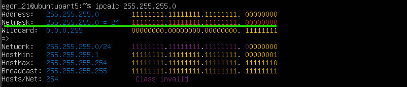
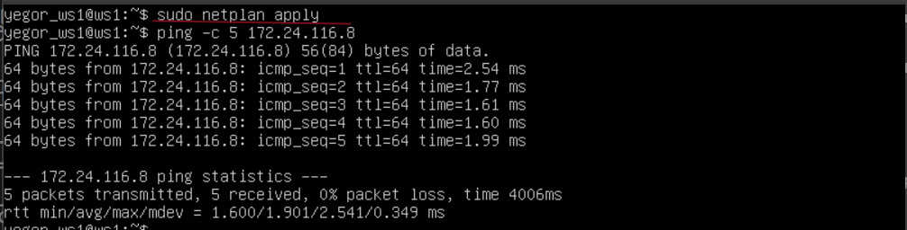
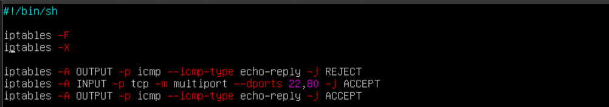
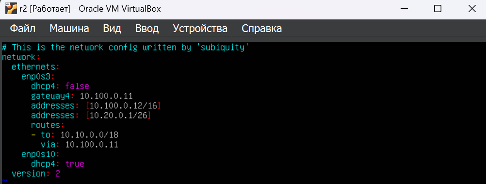
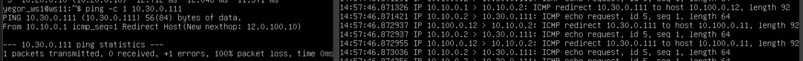
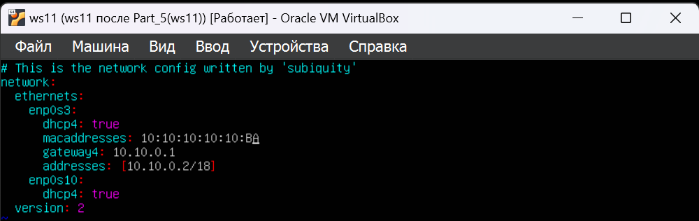

# Сети в Linux

## Part 1. Инструмент **ipcalc**

#### 1.1. Сети и маски
1)
\
Скриншот 1 - адрес сети 192.167.38.54/13
#

2)
\
Скриншот 2 - перевод маски 255.255.255.0 в префиксную и двоичную запись(префиксная запись - /24)
#

\
Скриншот 3 - перевод маски /15 в обычную и двоичную
#

#### Перевод 11111111.11111111.11111111.11110000 проиходит в ручную:
- В обычном виде - 255.255.255.240
- В формате маски - /24

\
Скриншот 4 - проверка ip 255.255.255.240
#

\
Скриншот 5 - минимальный и максимальный хост в сети 12.167.38.4/8
#

")\
Скриншот 6 - минимальный и максимальный хост в сети 12.167.38.4/11111111.11111111.00000000.00000000(255.255.0.0)
#

\
Скриншот 7 - минимальный и максимальный хост в сети 12.167.38.4/ 255.255.254.0
#

\
Скриншот 8 - минимальный и максимальный хост в сети 12.167.38.4/4
#

#### 1.2. localhost
#### Так как ip localhost стандартное, официально зарезервированное доменное имя для частных IP-адресов в диапазоне 127.0.0.1 — 127.255.255.254, следоватлеьно подходят ip: **127.0.0.2**, **127.1.0.1**

#### 1.3. Диапазоны и сегменты сетей
1) #### Диапазон частных ip адресов
- 10.0.0.0 - 10.255.255.255

- 172.16.0.0 - 172.31.255.255

- 192.168.0.0 - 192.168.255.255

Следовательно из списка в качестве частных можно использовать ip: 10.0.0.45, 192.168.4.2, 172.20.250.4, 172.16.255.255, 10.10.10.10

Остальные ip адреса можно использовать как в качетсве публичных

2) #### Диапазон частных ip адресов

\
Скриншот 9 - Диапазон шлюзов ip 10.10.0.0/18

- Из диапазона 10.10.0.1 - 10.10.63.254 следует, что ip 10.10.0.2, 10.10.10.10, 10.10.1.255 могут быть ip адресами шлюза

#

## Part 2. Статическая маршрутизация между двумя машинами

\
Скриншот 10 и 11 - Существующие сетевые интерфейсы 

#

\
Скриншот 11 и 12 - Задание сетевых интерфейсов для ws1 и ws2.
(ws1 - 192.168.100.10/16  ws2 - 172.24.116.8/12)
- comand `sudo vim /etc/netplan/00-installer-config.yaml`

#

Скриншот 13 и 14 -  Перезагрузка сетевых служб командой: `sudo netplan apply` 

#### 2.1. Добавление статического маршрута вручную

Скриншот 15 и 16 -  Добавление статических маршрутов от одной машины до другой и обратно при помощи команды вида `ip r add *** dev enp0s3`

#

Скриншот 16 и 17 -  Пропинговка соединения между машинами

#### 2.2. Добавление статического маршрута с сохранением

Скриншот 18 и 19 - Добавление статистичекого маршрута через `/etc/netplan/00-installer-config.yaml`

#

Скриншот 20 и 21 - Перезагрузка сетевых служб и пропинговка между серверами

## Part 3. Утилита **iperf3**

#### 3.1. Скорость соединения

- **8 Mbps** = 8 Mbps * (1 byte/8 bits) = **1 MB/s**
- **100 MB/s** = 100 MB/s * (8 Mb/MB) * 1024(Kbps/Mb) = **819 200 Kbps**
- **1 Gbps** = **1024** Mbps

#### 3.2. Утилита **iperf3**

- -s - запускает iperf3 в режиме сервера.
- -f - задает формат отчета(В данном случае используется формат **m - Mbits/s**)

- -c - запускает iperf3 в режиме клиента.

Скриншот 22 и 23 - Провека скорости соединения между ws1 и ws 2

## Part 4. Сетевой экран

#### 4.1. Утилита **iptables**
##### Создать файл */etc/firewall.sh*, имитирующий фаерволл, на ws1 и ws2:

Скриншот 24 и 25 - Создание файл */etc/firewall.sh*, имитирующий фаерволл, на ws1 и ws2

#

Скриншот 26 и 27 - Запуск команд 

- В первом случае(ws1) на пингование до подключение к порту 22, 80 невозможно

- Во втором случае(ws2) есть возможность пропинговать до подключение по порту 22 и 80, и после уже нельзя пропинговать сервер

#### 4.2. Утилита **nmap**

Скриншот 26 и 27 - Пропинговка защищенного сервера(ws1) и Дальнейшая проверка через `nmap` что сервер на самом деле работает

## Part 5. Статическая маршрутизация сети
#### 5.1. Настройка адресов машин

Скриншот 29 - 33 Настроить конфигурации машин в *etc/netplan/00-installer-config.yaml*

Скриншот 34 - 38 Применяем изменения и проверяем IP.
#

Скриншот 39 Пингуем ws22 c ws21
#

Скриншот 40 Пингуем r1 c ws11

#### 5.2. Включение переадресации IP-адресов.

Скриншот 41 и 42 Выполнение конмады для переадрессации IP - 
`sysctl -w net.ipv4.ip_forward=1`

#

Скриншот 43 и 44 Открытие файла */etc/sysctl.conf* и добавление в него следующуй строки:
`net.ipv4.ip_forward = 1`

#
#### 5.3. Установка маршрута по-умолчанию

Скриншот 45 - 49 добавление стандартного пути *gateway*

#

Скриншот 50 - 54 установка сетевых служб и вывод комманды `ip r`
#

Скриншот 55 и 56 Пропингование ws11 роутер r2 и показать на r2, что пинг доходит. Для этого использовать команду:

#### 5.4. Добавление статических маршрутов

Скриншот 57 и 58 добавление в роутеры r1 и r2 статические маршруты в файле конфигураций.

Скриншот 59 и 60 установка сетевых служб и вывод комманды `ip r`

Скриншот 61 Запустить команды на ws11:
`ip r list 10.10.0.0/18` и `ip r list 0.0.0.0/0`

#### 5.5. Построение списка маршрутизаторов

Скриншот 62 и 63 Запуск на r1 команду дампа:
`tcpdump -tnv -i enp0s3`
При помощи утилиты **traceroute** построить список маршрутизаторов на пути от ws11 до ws21

- Отправляется серию пакетов ближайшему узлу с TTL = 1, где TTL - время жизни, сколько узлов прошёл.
Если этот узел не необходимый, то вовзращает пакет прошлому узлу, с сообщением, что отправитель не найден; и отправляется другой пакет, с увеличенным TTL, на все остальные, доступные, узлы.
И так проверяются все узлы, находя нужный. После чего идут обратные пакеты, что пакет дошёл до адресата, соответсвенно идёт от адресата до отправителя.

#

Скриншот 64 Запуск на r1 перехвата сетевого трафика, проходящего через enp0s3 с помощью команды:
`tcpdump -n -i enp0s3 icmp`
Пропингование с ws11 несуществующий IP

## Part 6. Динамическая настройка IP с помощью **DHCP**

Скриншот 65 - Для r2 настройка в файле */etc/dhcp/dhcpd.conf* конфигурацию службы **DHCP**

Скриншот 66 - Запись `ameserver 8.8.8.8` в /etc/resolv.conf
#

Скриншот 67 - Перезапуск DHCP сервера с `systemctl restart isc-dhcp-server`
#

Скриншот 68 - Перезапуск ws21 и вызов ip a
#

Скриншот 69 - Пропинговка ws21 с ws22
#

Скриншот 70 - Указание МАК адресса для ws11 10:10:10:10:10:BA(и отметка dhcp4 - true)
#

Скриншот 71-73  - Настройка r1 также как и r1 но дополнительное указание МАК адресс для ws11
#

Скриншот 74-75  - Проверка настройки для r1
#

Скриншот 76  - Проверка изменения ip в ws21

## Part 7. **NAT**

Скриншот 77 - 78 - В файле `/etc/apache2/ports.conf` на ws22 и r1 изменение строки Listen 80 на Listen 0.0.0.0:80, то есть сделать сервер Apache2 общедоступным
#

Скриншот 79 - 80 - Запуск веб-сервера Apache командой `service apache2 start` на ws22 и r1

#

Скриншот 81  - 
Добавить в фаервол, созданный по аналогии с фаерволом из Части 4, на r2 следующие правила:
1) удаление правил в таблице filter - iptables -F
2) удаление правил в таблице "NAT" - iptables -F -t nat
3) отбрасывать все маршрутизируемые пакеты - iptables --policy FORWARD DROP
#

Скриншот 82 - запуск скрипта
#

Скриншот 83 Проверка соединения между ws22 и r1
#

Скриншот 83 - Обновление firewall
- Включение SNAT, а именно маскирование всех локальных ip из локальной сети, находящейся за r2
- Включение DNAT на 8080 порт машины r2 и добавить к веб-серверу Apache, запущенному на ws22, доступ извне сети

#

Скриншот 84 - Запуск скрипта

#

Скриншот 85 - Проверка соединение по TCP для SNAT, для этого с ws22 подключиться к серверу Apache на r1

#

Скриншот 86 - Проверка соединение по TCP для DNAT, для этого с r1 подключиться к серверу Apache на ws22

## Part 8. Дополнительно. Знакомство с **SSH Tunnels**

- Создание firewall для r2 как в Part_7

#

Скриншот 87 - Изменение порта на localhost в apache

#

Скриншот 88 - Старт сервера apache2

#

Скриншот 89 - Использование *Local TCP forwarding* с ws21 до ws22, чтобы получить доступ к веб-серверу на ws22 с ws21

`ssh -L 5555:localhost:80 10.20.0.20`

#

Скриншот 90 - Проверка соединения 
#

Скриншот 91 - Использование *Remote TCP forwarding* c ws11 до ws22, чтобы получить доступ к веб-серверу на ws22 с ws11

`ssh -R 5555:localhost:80 10.20.0.20`

#

Скриншот 92 - Проверка соединения 

