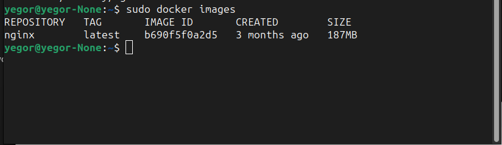
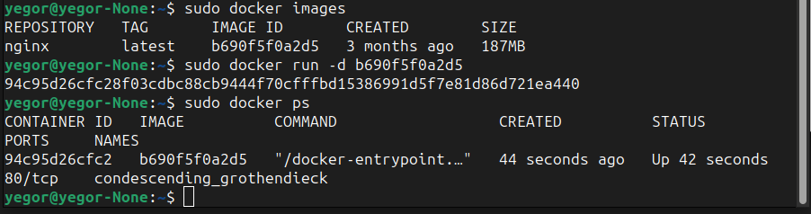
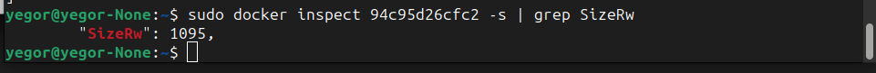
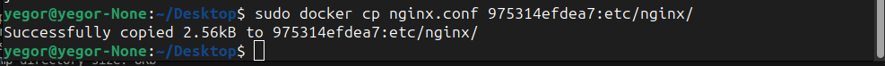
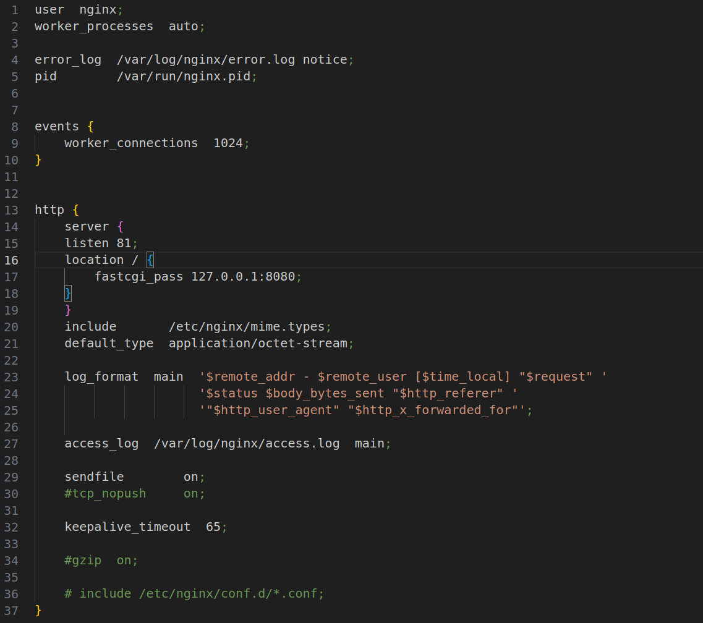
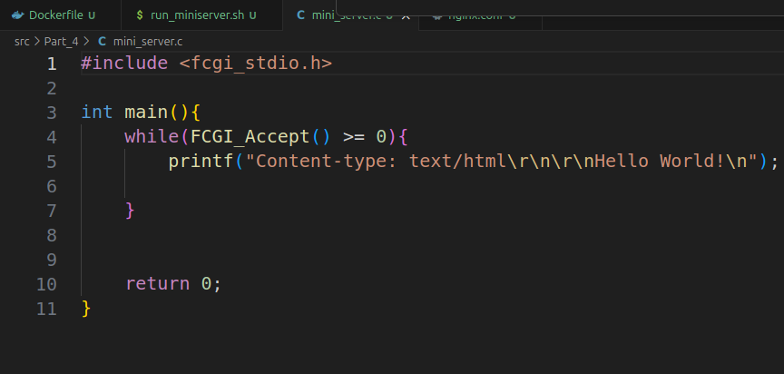

# Simple Docker

## Part 1. Готовый докер
 
Скриншот 1 - Взят официальный докер образ с **nginx** и выкачай его при помощи `docker pull`"
#
 
Скриншот 2 - Проверка наличия докер образа через `docker images`"
#
 
Скриншот 3 - Запуск докер образа через `docker run -d [image_id|repository]`
#
 
Скриншот 4 - Проверка, что образ запустился через `docker ps`
#
 
Скриншот 5 - Посмотр информации о контейнере через `docker inspect [container_id|container_name]`
#
 
Скриншот 6 - Размер контейнера
#
 
Скриншот 7 - Список замапленных портов
#
 
Скриншот 8 -  ip контейнера
#
 
Скриншот 9 - Остановка докер образ через `docker stop [container_id|container_name]`
#
 
Скриншот 10 - Проверка, что образ остановился через `docker ps`
#
 
Скриншот 11 - Запуск докер с портами 80 и 443 в контейнере, замапленными на такие же порты на локальной машине, через команду *run*
#
 
Скриншот 12 - Проверка, что в браузере по адресу *localhost:80* доступна стартовая страница **nginx**
#
 
Скриншот 13 - Перезапуск докер контейнер через `docker restart [container_id|container_name]`
#
 
Скриншот 14 - Проверка любым способом, что контейнер запустился

## Part 2. Операции с контейнером
 
Скриншот 15 - Прочитать конфигурационный файл *nginx.conf* внутри докер контейнера через команду *exec*
#
 
 
Скриншот 16 - 17 - Создан на локальной машине файл *nginx.
#
 
Скриншот 18 - Настройка в нем по пути */status* отдачу страницы статуса сервера **nginx**
#
 
Скриншот 19 - Скопирован созданный файл *nginx.conf* внутрь докер образа через команду `docker cp`
#
 
Скриншот 20 - Перезапуск **nginx** внутри докер образа через команду *exec*
#
 
Скриншот 21 - Проверь, что по адресу *localhost:80/status* отдается страничка со статусом сервера **nginx**
#
 
Скриншот 22 - Экспорт контейнера в файл *container.tar* через команду *export*
#
 
Скриншот 23 -   Остановка контейнер
#
 
Скриншот 24 - Удали образ через `docker rmi [image_id|repository]`, не удаляя перед этим контейнеры
#
 
Скриншот 25 - Удалиение остановленного контейнера
#
 
Скриншот 26 - Импортирт контейнера обратно через команду *import*
#
 
Скриншот 27 - Запуск импортированного контейнера
#
 
Скриншот 28 - Проверка что по адресу *localhost:80/status* отдается страничка со статусом сервера **nginx**
#

## Part 3. Мини веб-сервер
 
Скриншот 29 - Код для вывода Hellow World!
#
 
Скриншот 30 - Создан на локальной машине файл *nginx.
#
 
Скриншот 31 - Запуск докера с портом 81
#
 
Скриншот 33 - Копирование файлов на докер
#
 
Скриншот 34 - Вход внутрь докера
#
 
Скриншот 35 - Компиляция и запуск кода
#
 
Скриншот 36 - Вывод порат 81 на localhost
#
 
Скриншот 37 - Положи файл *nginx.conf* по пути *./nginx/nginx.conf* (это понадобится позже)
#

## Part 4. Свой докер
- Написать свой докер образ, который:
##### 1) собирает исходники мини сервера на FastCgi из [Части 3](#part-3-мини-веб-сервер)
##### 2) запускает его на 8080 порту
##### 3) копирует внутрь образа написанный *./nginx/nginx.conf*
##### 4) запускает **nginx**.

 
<!-- Скриншот 38 - Код для вывода Hellow World! -->
 
<!-- Скриншот 39 - Создан на локальной машине файл *nginx. -->
 
Скриншот 38 - 40 - Подготовка файлов для создания docker образа
#
 
Скриншот 41 - Сборка написанного докер образ через `docker build` при этом указав имя и тег
#
 
Скриншот 42 - Проверка через `docker images`, что все собралось корректно
 
Скриншот 43 - Запуск собранного докер образ с маппингом 81 порта на 80 на локальной машине и маппингом папки *./nginx* внутрь контейнера по адресу, где лежат конфигурационные файлы **nginx**'а
#
 
Скриншот 44 - Перезапуск докер образ
#
 
Скриншот 44 - Вывод localhost/status
#

## Part 5. **Dockle**
 
Скриншот 45 - Сканирование образа из предыдущего задания через `dockle [image_id|repository]`
#
 
Скриншот 46 - Исправление ошибок
#
 
Скриншот 47 - Повторная сборка образа
 
Скриншот 48 - Успех, ошибок не найдено!
#

## Part 6. Базовый **Docker Compose**
 
Скриншот 49 - Проверка рабочих docker серверов
#
 

 
Скриншот 50-51 - Сбор и запуск проекта с помощью команд `docker-compose build` и `docker-compose up`
##### Проверь, что в браузере по *localhost:80* отдается написанная тобой страничка, как и ранее
 \
Скриншот 52 - Успех!
#

